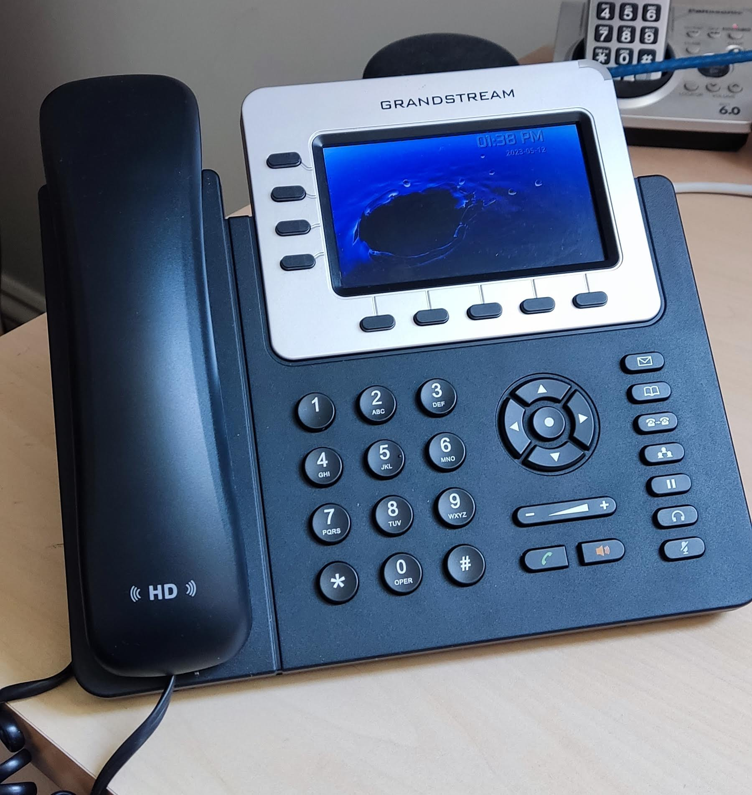
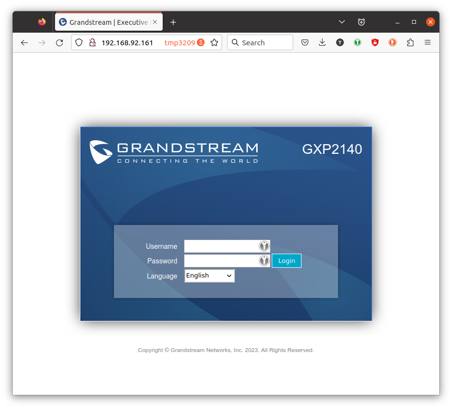
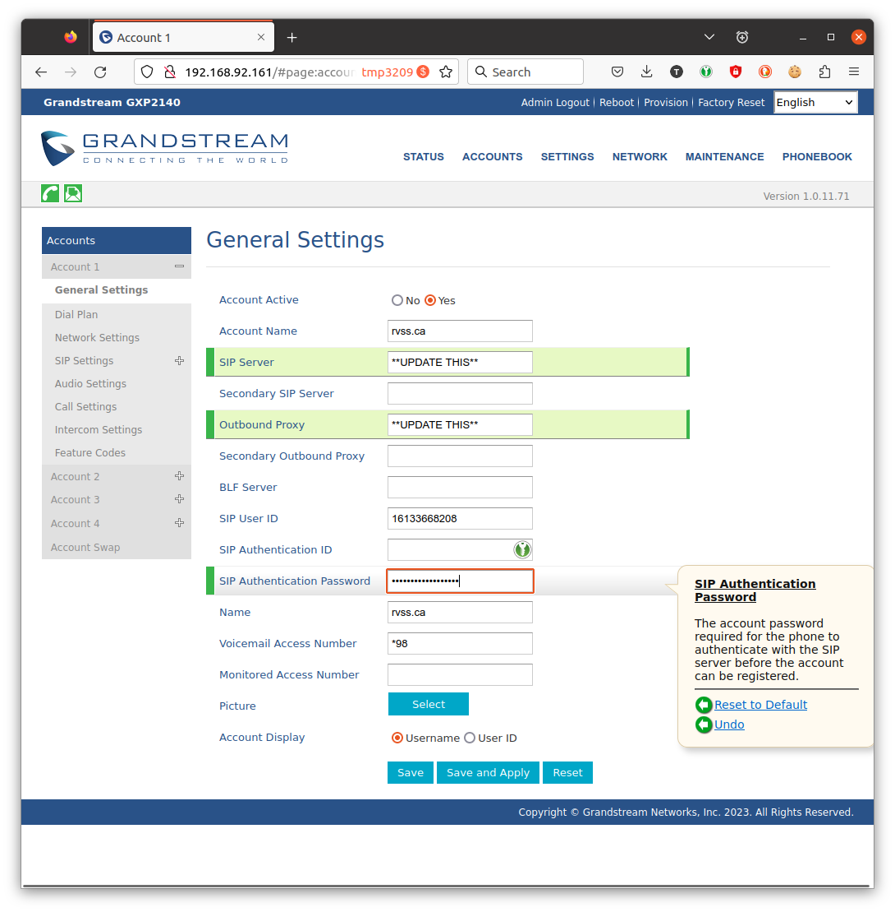
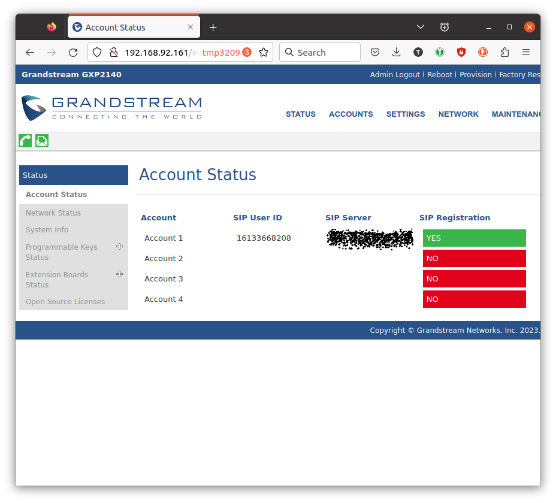

# VoIP
Configuration of the Grandstream GXP2140

The club is running a VoIP service for audio telephony. This repo describes the process of restoring the phone configuration in the event that the settings are lost or the phone is ever replaced with an identical model.

## How to restore the phone configuration.

The phone's configuration can be restored if the settings are lost or the phone is replaced by an identical unit.

### 1. Identify the IP of the phone.

Once the phone has been booted, it will request an IP address from our router. You'll need to identify the assigned IP before you can procede. There are many ways to do this. Get help if you don't know how.

### 2. Connect to the web interface of the phone.

In a browser, enter the IP of the phone. This example IP will not be the same. http://192.168.92.161

Once connected, you'll see a login page.

You'll need to ask the appropriate person for the username and password.

### 3. Maintenance -> Upgrade and Provisioning.

Navigate to Maintenance -> Upgrade and Provisioning. Find the line that says "Restore from Backup Package" and select [UPLOAD]. Identify the backup file in the usual way. The file included with this repo is good.

https://github.com/rvssca/VoIP/raw/main/gs-rvss-generic-backup.uf

Click [OK] to restore phonebook, call log, config, user configuration.

You will see "restore in progress" on the phone display.

After a pause, the phone will boot. Do not interrupt. It takes a couple of minutes.

### 4. Enter VoIP provider settings.

The phone needs to be configured for use with our VoIP provider.

In the browser, go to the IP of the phone again. It is possible the IP has changed since earlier! Login.

Go to Accounts -> Account 1 -> General Settings.

Enter the appropriate values for SIP Server, Outbound Proxy and SIP Authenication Password. These values can be provided by the appropriate club person.

Press [Save and Apply]

### 5. The phone is ready.

If the phone is connected to the Internet, you should see this.

